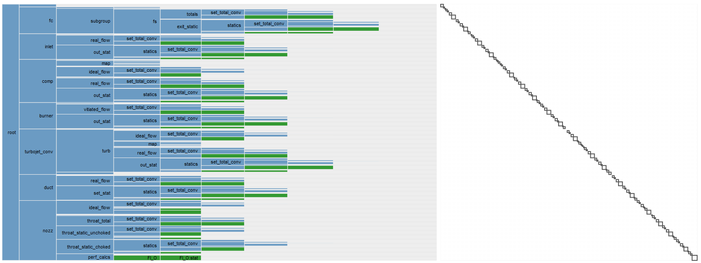
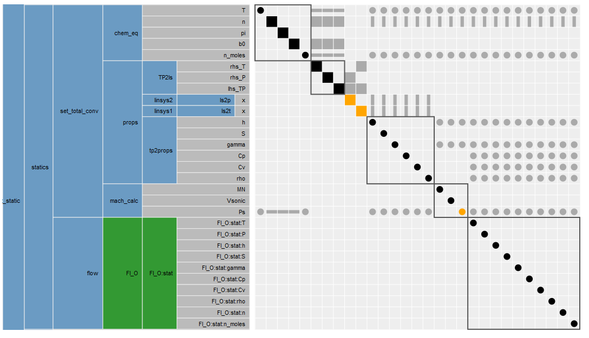
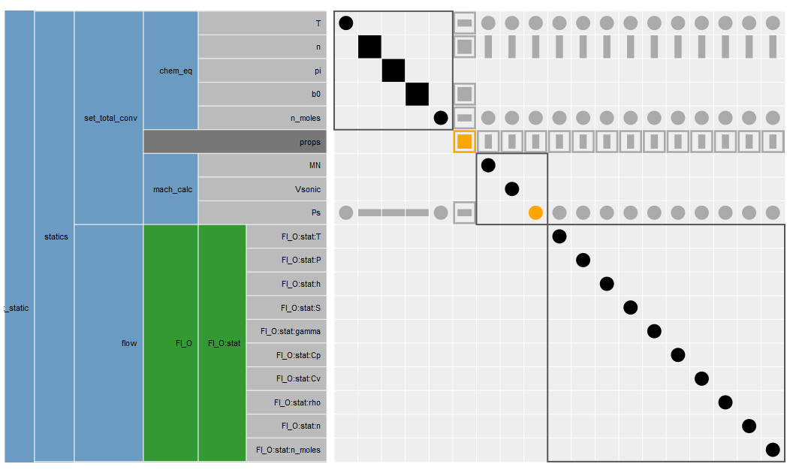
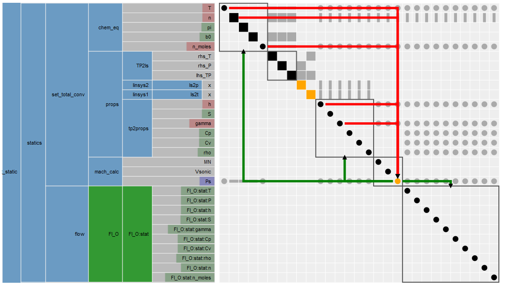
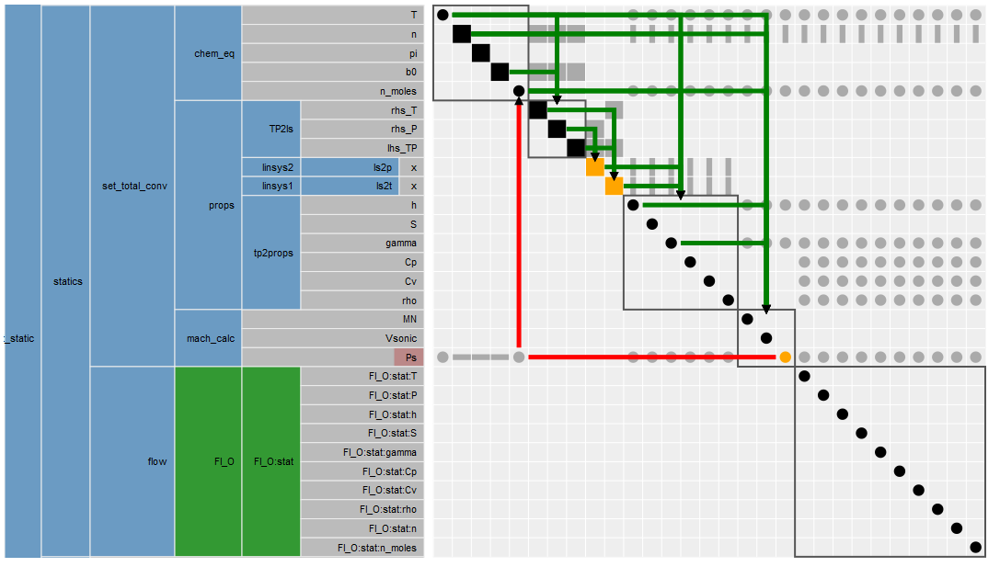
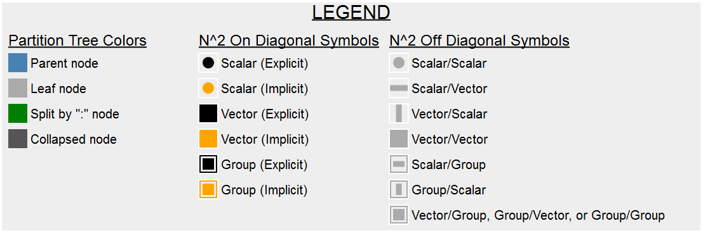

.. index:: MDAO tutorial problem

================================
Partition Tree and N^2 Diagram
================================

Overview
------------------
The Partition Tree and N^2 Diagram is a tool for viewing an OpenMDAO model.  The partition tree is shown on the left, and the N^2 diagram is on the right.  The partition tree shows the structure of the OpenMDAO model starting with the root node on the left and its children to the right.  These children (from left to right) include Groups, Subsystems, and Outputs.  Each node's height in the partition tree are sized by the total number of leaf nodes; the more leaf nodes, the taller the node.  When the partition tree is first loaded, all leaf nodes (the right most nodes) are Outputs.  Every node in the partition tree is in execution order from top to bottom.  Left clicking on a node in the partition tree will allow you to navigate to that node. Right clicking on a node will collapse/uncollapse it.

To the right of the Partition Tree is the N^2 (N-Squared) Diagram.  The right most nodes of the partition tree are on the diagonal of the N^2 diagram.  The connections are listed on the off-diagonal of the N^2 diagram.  Connections go from source to target in a clockwise order, so a connection in the upper right goes in normal execution order, but a connection in the bottom left is a feedback.  Hovering over an on-diagonal element will show source-to-connection arrows going to and/or from that element.  Hovering over an off-diagonal upper right connection element will show the clockwise source-to-connection arrow.  Hovering over an off-diagonal lower left connection element will show the clockwise source-to-connection feedback arrow, along with the associated execution cycle going back to the source.  A click on any element in the N^2 diagram will allow those arrows to persist.

   A full Pycycle model.

   Left clicking on the `statics` element in the Partition Tree will zoom in to it.

   Right clicking on the `props` group element in the Partition Tree will collapse its children.

   Hovering over the `Ps` on diagonal element in the N^2 diagram will show source-to-connection arrows going to and/or from that element.

   Hovering over the `Ps` off diagonal connection element in the N^2 diagram will show the clockwise source-to-connection feedback arrow, along with the associated execution cycle going back to the source.

   The legend explains the colors and symbols in the partition tree and N^2 diagrams.

Generating a Partition Tree and N^2 Diagram from your model.
----------------------------------------------------------------
Generating a Partition Tree and N^2 Diagram from your model is very simple.  It involves calling the `view_tree` function.  The `view_tree` function takes an OpenMDAO `Problem` as a parameter.  This `Problem` must call `setup()` before being passed to `view_tree`.  Below is an example on how to generate the diagram from the `Paraboloid` example.  It involves two lines of code at the bottom after `prob.setup()`.  Notice we don't need to call `prob.run()` to generate the diagram.  By default, this will generate a single file called `partition_tree_n2.html` and open it with the defaut web browser.  It will require a connection to the internet to fetch the latest version of D3.js.  The diagram has been tested in Chrome and Firefox.

.. testcode:: GenPartitionTree

    from openmdao.api import IndepVarComp, Component, Problem, Group

    class Paraboloid(Component):
        """ Evaluates the equation f(x,y) = (x-3)^2 + xy + (y+4)^2 - 3 """

        def __init__(self):
            super(Paraboloid, self).__init__()

            self.add_param('x', val=0.0)
            self.add_param('y', val=0.0)

            self.add_output('f_xy', val=0.0)

        def solve_nonlinear(self, params, unknowns, resids):
            """f(x,y) = (x-3)^2 + xy + (y+4)^2 - 3
            Optimal solution (minimum): x = 6.6667; y = -7.3333
            """

            x = params['x']
            y = params['y']

            unknowns['f_xy'] = (x-3.0)**2 + x*y + (y+4.0)**2 - 3.0

        def linearize(self, params, unknowns, resids):
            """ Jacobian for our paraboloid."""

            x = params['x']
            y = params['y']
            J = {}

            J['f_xy', 'x'] = 2.0*x - 6.0 + y
            J['f_xy', 'y'] = 2.0*y + 8.0 + x
            return J

    if __name__ == "__main__":

        prob = Problem()

        root = prob.root = Group()

        root.add('p1', IndepVarComp('x', 3.0))
        root.add('p2', IndepVarComp('y', -4.0))
        root.add('p', Paraboloid())

        root.connect('p1.x', 'p.x')
        root.connect('p2.y', 'p.y')

        prob.setup()

        #partition tree and n^2 diagram code
        from openmdao.api import view_tree
        view_tree(prob) #call view_tree(problem, outfile='partition_tree_n2.html', show_browser=True)

.. testcleanup:: GenPartitionTree

    import os
    if os.path.exists('partition_tree_n2.html'):
        os.remove('partition_tree_n2.html')
