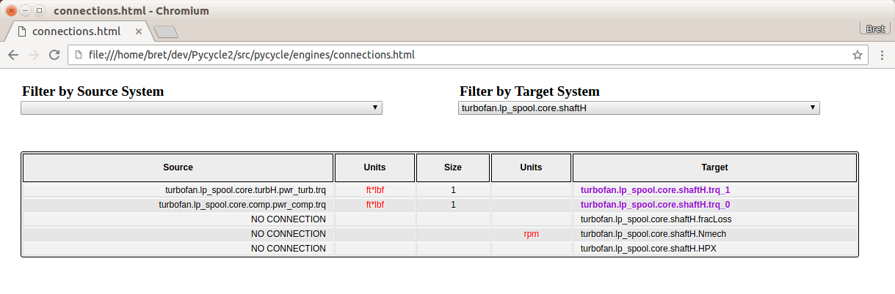

.. _OpenMDAO-Detailed-Connection-Viewing:

==========================
Viewing Connection Details
==========================

This tutorial describes how to view detailed information about connections
between variables in your model using the *view_connections* function.
The intent of *view_connections* is to help spot things like bad or missing
unit conversions, connections to inputs that are either unintended or missing,
or variables that have the wrong value.  In many cases, the *view_tree*
function, described in
:ref:`Visualizing OpenMDAO Model Structure and Connections <OpenMDAO-Visualizing-Model-Connections>`
may provide a faster way to spot missing or unintended connections.

The *view_connections* function may be called on a Problem or a Group, and it
will only work when called after Problem setup.  For example:

.. testcode:: view_connections

    from openmdao.api import Problem, Group, view_connections

    prob = Problem(root=Group())

    # define my model...

    prob.setup()

    # we'll set show_browser=False here to prevent a webbrowser from
    # popping up during our doc testing.
    view_connections(prob.root, show_browser=False)

The options you can pass to `view_connections` are:

    - **outfile**:  The name of the html output file. This defaults to *connections.html*.
    - **show_browser**: If True, pop up a webbrowser to view the file. Defaults to True.
    - **src_filter**: The starting path used for the source filter.  Defaults to '', which will show all source variables.
    - **tgt_filter**: The starting path used for the target filter.  Defaults to '', which will show all target variables.

The html file generated by *view_connections* is self-contained, so it can be
passed around to other people, but it does require network access in order to
load the d3 library.

The following shows what the viewer looks like for a pycycle turbofan model:

Source variables are shown in the left column, followed by a column containing
their units.  The center column contains the value of the target variable.  
If the variable is an array or any other object with a string
representation of more than 20 characters, the column entry is a **View** button
that will pop up a very simple viewer for that variable when you click on it.
The following figure shows what the viewer looks like. To make the viewer go away,
just click anywhere in the area outside of it.

.. figure:: images/connections_popup.png
   :align: center
   :alt: An example of an array entry viewer popup.

The entries in the value column are displayed in the units of the target variable,
except when looking at unconnected source variables. The value column is
followed by the target units and finally the name of the target variable.
Units are highlighted in red when the source unit differs from the target unit.

Note the scrollbar on the right, which is necessary due to the large number of
connections found in the turbofan model.  Using the **Filter by Source System**
and **Filter by Target System** fields at the top of the page, we can zero in
on parts of the model and ignore the rest.  For example, if we were interested
only in what's connected to the inputs of the *turbofan.lp_spool.core.shaftH*
component, we could put that in the **Filter by Target System** field.  We would
then see the following:

There are two things to mention here.  First, note that some of the target
names are highlighted.  Those are inputs that are connected to source variables
found outside of the target system.  In this particular case, where our target
is a Component, not a Group, any inputs that are connected will be highlighted,
because their sources will always be outside of that Component.  If our target
system were a Group, then some of the connections would be internal to that
Group, and some would cross the Group boundary.  Those crossing the Group
boundary would be highlighted.  The second thing to mention is that even
unconnected variables are shown in the viewer, but their source or target
will be displayed as **NO CONNECTION**.  This can be useful when you want to
show all dangling input variables on a specific Group or Component, for example:

Here we show all unconnected inputs found on the
*turbofan.lp_spool.core.turbH.in_flow* Component by specifying the Component
name in the **Filter by Target System** field and **NO CONNECTION** in the
**Filter by Source System** field.
