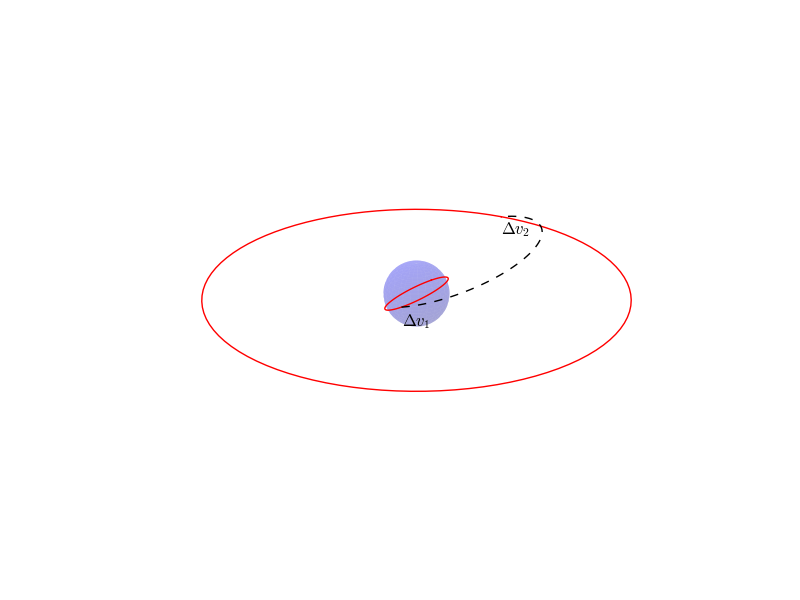
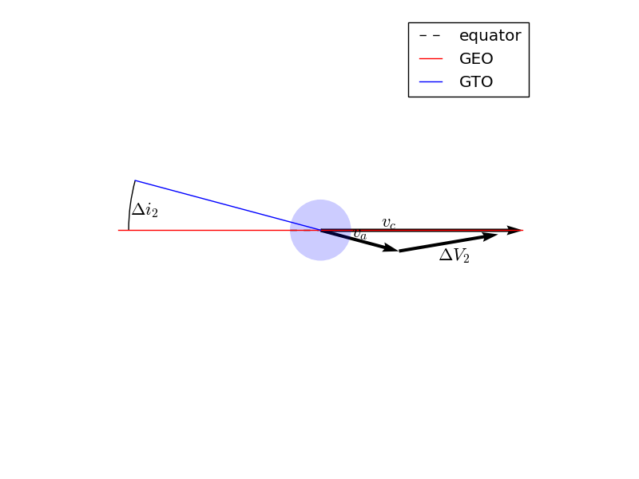

.. _`hohmann_tutorial`:

Hohmann Transfer Tutorial - Optimizing a Spacecraft Manuever
============================================================

This tutorial will demonstrate the use of OpenMDAO for optimizing
a simple orbital mechanics problem.  We seek the minimum possible
delta-V to transfer a spacecraft from Low Earth Orbit (LEO) to
geostationary orbit (GEO) using a two-impulse *Hohmann Transfer*.

The Hohmann Transfer is a maneuver which minimize the delta-V for
transfering a spacecraft from one circular orbit to another.  Hohmann
transfer's have a practical application in that they can be used
to transfer satellites from LEO parking orbits to geostationary orbit.

To do so, the vehicle first imparts a delta-V along the velocity vector
while in LEO.  This boosts apogee radius to the radius of the geostationary
orbit (42164 km).  In this model we will model this delta-V as an *impulsive*
maneuver which changes the spacecraft's velocity instantaneously.

We will assume that the first impulse is performed at the
ascending node in LEO.  Thus perigee of the transfer orbit is coincident
with the ascending node of the transfer orbit.  Apogee of the transfer orbit
is thus coincident with the descending node, where we will perform the
second impulse.

After the first impulse, the spacecraft coasts to apogee.  Once there
it impulse a second burn along the velocity vector to raise perigee radius
to the radius of GEO, thus circularizing the orbit.

Simple, right?  The issue is that, unless they launch from the equator,
launch vehicles do not put satellites in a low Earth parking orbit
with the same inclination as geostationary orbit.  For instance, a due east launch
from Kennedy Space Center will result in a parking orbit with an inclination of
28.5 degrees.  We therefore need to change the inclination of our satellite during
it's two impulsive burn maneuvers.  The question is, *what change in inclination
at each burn will result in the minimum possible :math:`\Delta V`?*

   An inclined Hohmann Transfer diagram

The trajectory optimization problem can thus be stated as:

.. math::
    Minimize J=\Delta V

    s.t.

    \Delta i_1 + \Delta i_2 = 28.5

The total :math:`\Delta V` is the sum of the two impulsive :math:`\Delta Vs`.

.. figure:: images/hohmann_dv1.png
   :align: center
   :width: 500 px
   :alt: Vector diagram of the first impulsive :math:`\Delta V`

   Vector diagram of the first impulsive :math:`\Delta V`

The component of the :math:`\Delta V` in the orbital plane is along the
local horizontal plane.  The orbit-normal component is in the
direction of the desired inclination change.  Knowing the
velocity magnitude before (:math:`v_c`) and after (:math:`v_p`) the impulse, and the
change in inclination due to the impulse (:math:`\Delta i`), the :math:`\Delta V`
is then computed from the law of cosines:

.. math::
    \Delta V_1 = v_c^2 + v_p^2 - 2 v_c v_p \cos{\Delta i}

In the first impulse, :math:`v_1` is the circular velocity in LEO.  In
this case :math:`v_c` refers to the circular velocity in geostationary
orbit, and :math:`v_a` is the velocity at apogee of the transfer
orbit.

We can compute the circular velocity in either orbit from
the following equation:

.. math::
    v_c = \sqrt{\mu/r}

where :math:`\mu` is the gravitational parameter of the Earth
and :math:`r` is the distance from the center of the Earth.

The velocity after the first impulse is the periapsis velocity
of the transfer orbit.  This can be solved for based on what we
know about the orbit.

The specific angular momentum of the transfer orbit is constant.
At periapsis, it is simply the product of the velocity and radius.
Therefore, rearranging we have:

.. math::
    v_p = \frac{h}{r_p}

The specific angular momentum can also be computed as:

.. math::
    h = \sqrt{p \mu}

Where :math:`p` is the semilatus rectum of the orbit and :math:`\mu` is
the gravitational paramter of the central body.

The semilatus rectum is computed as:

.. math::

    p = a*(1.0-e^2)

Where :math:`a` and :math:`e` are the semi-major axis and eccentricity of the transfer orbit, respectively.
Since we know :math:`r_a` and :math:`r_p` of the transfer orbit, it's semimajor axis is simply:

.. math::

    e = (a-r_p)/a

The eccentricity is known by the relationship of :math:`a` and :math:`e` to :math:`r_p` (or :math:`r_a`):

.. math::

    a = (r_a+r_p)/2.0

Thus we can compute periapsis velocity based on the periapsis and apoapsis
radii of the transfer orbit, and the gravitational parameter of the central body.

For the second impulse, the final velocity is the circular velocity of the
final orbit, which can be computed in the same way as the circular velocity
of the initial orbit.  The initial velocity at the second impulse is the
apoapsis velocity of the transfer orbit, which is:

   Vector diagram of the second impulsive :math:`\Delta V`

.. math::

    \Delta V = v_a^2 + v_c^2 - 2 v_a v_c \cos{\Delta i}

.. math::

    v_a = \frac{h}{r_a}

Having already computed the specific angular momentum of the transfer orbit, this is
easily computed.

Finally we have the necessary calculations to compute the :math:`\Delta V` of the Hohmann
transfer with a plane change.

.. testsetup:: hohmann

    import numpy as np
    from openmdao.api import IndepVarComp, Component, Group, Problem, ExecComp, ScipyOptimizer, SqliteRecorder

Components
----------

VCircComp
~~~~~~~~~

*VCircComp* calculates the circular orbit velocity given an orbital radius and gravitational parameter.

.. testcode:: hohmann

    class VCircComp(Component):
        """ Computes the circular orbit velocity given a radius and gravitational
        parameter.
        """

        def __init__(self, radius=6378.14+400, mu=398600.4418):
            super(VCircComp, self).__init__()

            # Derivative specification
            self.deriv_options['type'] = 'user'

            self.deriv_options['check_type'] = 'cs'
            self.deriv_options['check_step_size'] = 1.0e-16

            self.add_param('r',
                           val=radius,
                           desc='Radius from central body',
                           units='km')

            self.add_param('mu',
                           val=mu,
                           desc='Gravitational parameter of central body',
                           units='km**3/s**2')

            self.add_output('vcirc',
                            val=1.0,
                            desc='Circular orbit velocity at given radius '
                                 'and gravitational parameter',
                            units='km/s')

        def solve_nonlinear(self, params, unknowns, resids):
            r = params['r']
            mu = params['mu']

            unknowns['vcirc'] = np.sqrt(mu/r)

        def linearize(self, params, unknowns, resids):
            r = params['r']
            mu = params['mu']
            vcirc = unknowns['vcirc']

            J = {}
            J['vcirc', 'mu'] = 0.5/(r*vcirc)
            J['vcirc', 'r'] = -0.5*mu/(vcirc*r**2)
            return J

TransferOrbitComp
~~~~~~~~~~~~~~~~~

.. testcode:: hohmann

    class TransferOrbitComp(Component):

        def __init__(self):
            super(TransferOrbitComp, self).__init__()

            # Derivative specification
            self.deriv_options['type'] = 'fd'

            self.add_param('mu',
                           val=398600.4418,
                           desc='Gravitational parameter of central body',
                           units='km**3/s**2')
            self.add_param('rp', val=7000.0, desc='periapsis radius', units='km')
            self.add_param('ra', val=42164.0, desc='apoapsis radius', units='km')

            self.add_output('vp', val=0.0, desc='periapsis velocity', units='km/s')
            self.add_output('va', val=0.0, desc='apoapsis velocity', units='km/s')

        def solve_nonlinear(self, params, unknowns, resids):

            mu = params['mu']
            rp = params['rp']
            ra = params['ra']

            a = (ra+rp)/2.0

            e = (a-rp)/a

            p = a*(1.0-e**2)

            h = np.sqrt(mu*p)

            unknowns['vp'] = h/rp
            unknowns['va'] = h/ra

DeltaVComp
~~~~~~~~~~

.. testcode:: hohmann

    class DeltaVComp(Component):

        def __init__(self):
            super(DeltaVComp, self).__init__()

            # Derivative specification
            self.deriv_options['type'] = 'user'

            self.add_param('v1', val=1.0, desc='Initial velocity', units='km/s')
            self.add_param('v2', val=1.0, desc='Final velocity', units='km/s')
            self.add_param('dinc', val=1.0, desc='Plane change', units='rad')

            # Note:  We're going to use trigonometric functions on dinc.  The
            # automatic unit conversion in OpenMDAO comes in handy here.

            self.add_output('delta_v', val=0.0, desc='Delta-V', units='km/s')

        def solve_nonlinear(self, params, unknowns, resids):

            v1 = params['v1']
            v2 = params['v2']
            dinc = params['dinc']

            unknowns['delta_v'] = v1**2 + v2**2 - 2*v1*v2*np.cos(dinc)

        def linearize(self, params, unknowns, resids):
            v1 = params['v1']
            v2 = params['v2']
            dinc = params['dinc']

            J = {}
            J['delta_v','v1'] = 2*v1 - 2*v2*np.cos(dinc)
            J['delta_v','v2'] =  2*v2 - 2*v1*np.cos(dinc)
            J['delta_v','dinc'] = 2*v1*v2*np.sin(dinc)

            return J

Assembling the Problem
----------------------

.. testcode:: hohmann

    prob = Problem(root=Group())

    root = prob.root

    root.add('mu_comp', IndepVarComp('mu', val=0.0, units='km**3/s**2'),
             promotes=['mu'])

    root.add('r1_comp', IndepVarComp('r1', val=0.0, units='km'),
             promotes=['r1'])
    root.add('r2_comp', IndepVarComp('r2', val=0.0, units='km'),
             promotes=['r2'])

    root.add('dinc1_comp', IndepVarComp('dinc1', val=0.0, units='deg'),
             promotes=['dinc1'])
    root.add('dinc2_comp', IndepVarComp('dinc2', val=0.0, units='deg'),
             promotes=['dinc2'])

    root.add('leo', system=VCircComp())
    root.add('geo', system=VCircComp())

    root.add('transfer', system=TransferOrbitComp())

    root.connect('r1', ['leo.r', 'transfer.rp'])
    root.connect('r2', ['geo.r', 'transfer.ra'])

    root.connect('mu', ['leo.mu', 'geo.mu', 'transfer.mu'])

    root.add('dv1', system=DeltaVComp())

    root.connect('leo.vcirc', 'dv1.v1')
    root.connect('transfer.vp', 'dv1.v2')
    root.connect('dinc1', 'dv1.dinc')

    root.add('dv2', system=DeltaVComp())

    root.connect('transfer.va', 'dv2.v1')
    root.connect('geo.vcirc', 'dv2.v2')
    root.connect('dinc2', 'dv2.dinc')

    root.add('dv_total', system=ExecComp('delta_v=dv1+dv2',
                                         units={'delta_v': 'km/s',
                                                'dv1': 'km/s',
                                                'dv2': 'km/s'}),
             promotes=['delta_v'])

    root.connect('dv1.delta_v', 'dv_total.dv1')
    root.connect('dv2.delta_v', 'dv_total.dv2')

    root.add('dinc_total', system=ExecComp('dinc=dinc1+dinc2',
                                           units={'dinc': 'deg',
                                                  'dinc1': 'deg',
                                                  'dinc2': 'deg'}),
             promotes=['dinc'])

    root.connect('dinc1', 'dinc_total.dinc1')
    root.connect('dinc2', 'dinc_total.dinc2')

    prob.driver = ScipyOptimizer()

    prob.driver.add_desvar('dinc1', lower=0, upper=28.5)
    prob.driver.add_desvar('dinc2', lower=0, upper=28.5)
    prob.driver.add_constraint('dinc', lower=28.5, upper=28.5, scaler=1.0)
    prob.driver.add_objective('delta_v', scaler=1.0)

    # Setup the problem

    prob.setup()

    # Set initial values

    prob['mu'] = 398600.4418
    prob['r1'] = 6778.137
    prob['r2'] = 42164.0

    prob['dinc1'] = 0.0
    prob['dinc2'] = 28.5

    # Use run_once to evaluate the model at the initial guess.
    # This will give us the :math:`\Delta V` for performing
    # the entire plane change at apogee.

    prob.run_once()

    dv_all_apogee = prob['delta_v']

    # Go!

    prob.run()

    print('Impulse 1:')
    print('    Delta-V: {0:6.4f} km/s'.format(prob['dv1.delta_v']))
    print('    Inclination Change: {0:6.4f} deg'.format(prob['dinc1']))
    print('Impulse 2:')
    print('    Delta-V: {0:6.4f} km/s'.format(prob['dv2.delta_v']))
    print('    Inclination Change: {0:6.4f} deg'.format(prob['dinc2']))
    print('Total Delta-V: {0:6.4f} km/s'.format(prob['delta_v']))
    print('Total Plane Change: {0:6.4f} deg'.format(prob['dinc']))
    print('\nPerforming the plane change at apogee gives a '
          'Delta-V of {0:6.4f} km/s'.format(dv_all_apogee))

The resulting output is

::

    Impulse 1:
        Delta-V: 5.8132 km/s
        Inclination Change: 1.6673 deg
    Impulse 2:
        Delta-V: 3.1928 km/s
        Inclination Change: 26.8327 deg
    Total Delta-V: 9.0060 km/s
    Total Plane Change: 28.5000 deg

    Performing the plane change at apogee gives a Delta-V of 9.0751 km/s

.. testoutput:: hohmann
    :hide:
    :options: +ELLIPSIS

    ...
    Impulse 1:
        Delta-V: 5.8132 km/s
        Inclination Change: 1.6673 deg
    Impulse 2:
        Delta-V: 3.1928 km/s
        Inclination Change: 26.8327 deg
    Total Delta-V: 9.0060 km/s
    Total Plane Change: 28.5000 deg

    Performing the plane change at apogee gives a Delta-V of 9.0751 km/s

In general, changes in inclination are most efficiently performed at apogee,
and on the line of nodes.  However, in this case, we see that if we naively
perform the entirety of the plane change at apogee, we pay a :math:`\Delta V`
penalty of about 70 m/s.

.. tags:: Tutorials, Hohmann, Optimization
