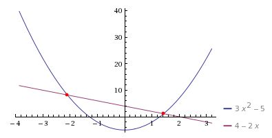

.. _`solver_tutorial`:

Solving an Implicit Relationship with a Newton Solver
=====================================================

This tutorial will show how to use a solver to drive some unknown in your
model to zero by varying a param. In OpenMDAO you do this by adding a
component with an implicit equation, and specifying a nonlinear solver in the
containing group.

We will illustrate this with a simple problem.

Find the Intersection of a Parabola and a Line
----------------------------------------------

Consider a parabola defined by "y = 3x^2 - 5" and a line defined by "y = -2x + 4".
We would like to find their intersection.

Thie figure above shows that there are two solutions to this problem. We will
implement this in OpenMDAO and find both solutions.

For our approach, we will consider the line and parabola as separate
disciplines, each requiring its own `Component` definition that takes a value
'x' as an input param, and produces the output 'y'. Implementing these 2
components with derivatives is straightforward:

.. testcode:: Solver1

        from __future__ import print_function

        from openmdao.api import Component, Group, Problem, Newton, ScipyGMRES

        class Line(Component):
            """Evaluates y = -2x + 4."""

            def __init__(self):
                super(Line, self).__init__()

                self.add_param('x', 1.0)
                self.add_output('y', 0.0)

                # User can change these.
                self.slope = -2.0
                self.intercept = 4.0

            def solve_nonlinear(self, params, unknowns, resids):
                """ y = -2x + 4 """

                x = params['x']
                m = self.slope
                b = self.intercept

                unknowns['y'] = m*x + b

            def linearize(self, params, unknowns, resids):
                """ Jacobian for our line."""

                m = self.slope
                J = {}

                J['y', 'x'] = m
                return J

        class Parabola(Component):
            """Evaluates y = 3x^2 - 5"""

            def __init__(self):
                super(Parabola, self).__init__()

                self.add_param('x', 1.0)
                self.add_output('y', 0.0)

                # User can change these.
                self.a = 3.0
                self.b = 0.0
                self.c = -5.0

            def solve_nonlinear(self, params, unknowns, resids):
                """ y = 3x^2 - 5 """

                x = params['x']
                a = self.a
                b = self.b
                c = self.c

                unknowns['y'] = a*x**2 + b*x + c

            def linearize(self, params, unknowns, resids):
                """ Jacobian for our parabola."""

                x = params['x']
                a = self.a
                b = self.b
                J = {}

                J['y', 'x'] = 2.0*a*x + b
                return J

We have made these components slightly more general so that you can, for
example, change the slope and intercept of the `Line` to try solving
different problems.

Now we need to add a component that defines a residual for the difference
between "parabola.y" and "line.y". We want to let an OpenMDAO solver drive
this difference to zero.

.. testcode:: Solver1

        class Balance(Component):
            """Evaluates the residual y1-y2"""

            def __init__(self):
                super(Balance, self).__init__()

                self.add_param('y1', 0.0)
                self.add_param('y2', 0.0)
                self.add_state('x', 5.0)

            def solve_nonlinear(self, params, unknowns, resids):
                """This component does no calculation on its own. It mainly holds the
                initial value of the state. An OpenMDAO solver outside of this
                component varies it to drive the residual to zero."""
                pass

            def apply_nonlinear(self, params, unknowns, resids):
                """ Report the residual y1-y2 """

                y1 = params['y1']
                y2 = params['y2']

                resids['x'] = y1 - y2

            def linearize(self, params, unknowns, resids):
                """ Jacobian for our parabola."""

                J = {}
                J['x', 'y1'] = 1.0
                J['x', 'y2'] = -1.0
                return J

This component holds both our state and the residual. This component produces
no explicit outputs, so the `solve_nonlinear` method doesn't do anything (but
it still must be declared). In the `apply_nonlinear` method, we take the
difference "y1-y2" and place it in the residual for "x". The derivatives are
straightforward.

Note that the residual equation is not a direct function of the state, but it
is indirectly a function via y1 and y2. The partial derivative of the
residual with respect to 'x' is zero, though the total derivative calculated
by OpenMDAO of the residual with respect to 'x' is nonzero.

Finally, lets set up the model.

.. testcode:: Solver1

    top = Problem()
    root = top.root = Group()
    root.add('line', Line())
    root.add('parabola', Parabola())
    root.add('bal', Balance())

    root.connect('line.y', 'bal.y1')
    root.connect('parabola.y', 'bal.y2')
    root.connect('bal.x', 'line.x')
    root.connect('bal.x', 'parabola.x')

    root.nl_solver = Newton()
    root.ln_solver = ScipyGMRES()

    top.setup()

Here we connect the output of the Line and Parabola component to the params
of the Balance component. The state on "Balance" feeds the params on both
components.

To solve this system, we need to specify a nonlinear solver in
"root.nl_solver". There are two types of solvers in OpenMDAO: nonlinear
solvers and linear solvers.

A nonlinear solver is used to drive residuals to zero by varying other
quantities in your model. The quantities that are varied by the nonlinear
solver include all states, but also include any cyclic params on the first
component in a cycle. Every unknown in OpenMDAO has a corresponding residual
and the nonlinear solver seeks to drive the norm of all the residuals to
zero.

A linear solver solves the linearized system of equations in order to
calculate a gradient (though there are some other uses too such as
preconditioning.)

Every `Group` contains a linear solver in `ln_solver` and a nonlinear solver
in `nl_solver'.` The default nonliinear solver is called `RunOnce` which just
runs the components in the group one time without driving the residuals to
zero. The default linear solver is `LinearGaussSeidel`, which is an adequate
chain rule solution for the gradient, but must be replaced if your model has
cycles or states.

The Newton solver is well-suited for solving this sort of
problem, and is the solver you will generally use when solving any system
with an implicit state, so we specify Newton in "root.nl_solver". The Newton
solver requires gradients and calculates them through use of the linear
solver in "root.ln_solver". The default solver is LinearGaussSeidel, but to
calculate the gradients across a system with implicit states, we should use
the `ScipyGMRES` linear solver, which handles the coupled problem by solving
a system of linear equations.

.. testcode:: Solver1

   top.run()
   print('Solution x=%.2f, line.y=%.2f, parabola.y=%.2f' % (top['bal.x'], top['line.y'], top['parabola.y']))

Running our code should give us an answer:

.. testoutput:: Solver1
   :options: +ELLIPSIS

   Solution x=1.43, line.y=1.14, parabola.y=1.14

On Initial Values for States
----------------------------

Our problem has two solutions, and we have found one of them. Which solution
you arrive at is determined by the initial condition you chose, specifically
the solution follows the gradient from the initial point to the solution.

We can find both solutions then:

.. testcode:: Solver1

    # Positive solution
    top['bal.x'] = 7.0
    root.list_states()
    top.run()
    print('Positive Solution x=%.2f, line.y=%.2f, parabola.y=%.2f' % (top['bal.x'], top['line.y'], top['parabola.y']))

    # Negative solution
    top['bal.x'] = -7.0
    root.list_states()
    top.run()
    print('Negative Solution x=%.2f, line.y=%.2f, parabola.y=%.2f' % (top['bal.x'], top['line.y'], top['parabola.y']))

.. testoutput:: Solver1
   :options: +ELLIPSIS
   :hide:

   Positive Solution x=1.43, line.y=1.14, parabola.y=1.14
   Negative Solution x=-2.10, line.y=8.19, parabola.y=8.19

OpenMDAO provides a function `list_states` that lists all the states
contained in a group and all of its subgroups. This can be useful in larger
nested models that have many implicit components. Since your initial state
potentially feeds the initial params in other components, it is important to
inspect them to make sure they are correct.

::

   States in model:
   bal.x: 7.000000

   Positive Solution x=1.43, line.y=1.14, parabola.y=1.14

   States in model:
   bal.x: -7.000000

   Negative Solution x=-2.10, line.y=8.19, parabola.y=8.19

   .. tags:: Tutorials
