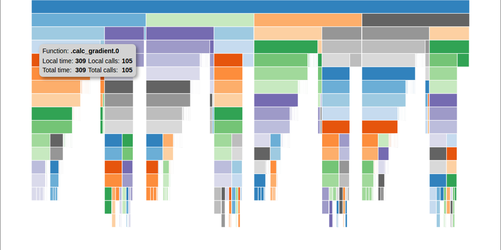

.. _OpenMDAO-Profiling:

=========
Profiling
=========

This tutorial describes how to use OpenMDAO's simple instance based profiling
capability.  Python has several good profilers available for general python
code, and instance based profiling is not meant to replace general profiling.
However, because the OpenMDAO profiler lets you view the profiled functions grouped
by the specific problem, system, group, driver, or solver that called them, it
can provide insight into which parts of your model are more expensive, even when
different parts of your model use many of the same underlying functions.

To use profiling, you first have to call `profile.setup`. This must happen
after your system tree has been defined. This is necessary because the setup
process traverses down the tree searching for instance methods to wrap with
profiling information, and if those instance methods don't exist yet then
they cannot be wrapped. You must pass a top level object, typically your
Problem object, to `profile.setup`.

After profiling has been set up, you then call `profile.start` to
start collection of profiling data.  If for some reason you want to only
collect profiling data during a particular part of execution, you can call
`profile.stop` to turn off collection.  For example:

.. testcode:: profile_activate

    from openmdao.api import Problem, Group
    from openmdao.api import profile

    prob = Problem(root=Group())

    # define my model...

    profile.setup(prob)
    profile.start()

    prob.setup()

    prob.run()

    profile.stop()

    # do some other stuff that I don't want to profile...

There are a few advanced options to `profile.setup`, but in general you
won't need them.  Consult the docstring to learn more.

After your script is finished running, you should have two new files,
`prof_raw.0` and `funcs_prof_raw.0` in your current directory.  If you happen
to have activated profiling for an MPI run, then you'll have a copy of those
two files for each MPI process, so `prof_raw.0`, `prof_raw.1`, etc.

There are two command scripts you can run on those raw data files.  The first
is `proftotals`.  Running that on raw profiling files will give you CSV
formatted output containing total runtime and total number of calls for
each profiled function.  For example: `proftotals prof_raw.*` might
give you output like the following:

::

    Function Name, Total Time, Calls
    .calc_gradient.2, 40.9992446899, 1
    .calc_gradient.0, 40.9991188049, 1
    .calc_gradient.1, 40.9931678772, 1
    .LinearGaussSeidel.solve.2, 30.7603917122, 31
    .LinearGaussSeidel.solve.1, 29.2816333771, 31
    .LinearGaussSeidel.solve.0, 29.000962019, 31
    ._transfer_data.2, 20.4067265987, 352
    ._transfer_data.0, 15.5122716427, 352
    ._transfer_data.1, 13.8179996014, 352
    ...

The second command script is `profview`.  It generates an html
file called `profile_icicle.html` that
uses a d3-based icicle plot to show the function call tree. The file should
be viewable in any browser. Hovering over a box in the plot will show the
function pathname, the local and total elapsed time for that function, and the
local and total number of calls for that function. Also, all occurrences of that
particular function will be highlighted.  Clicking on a box will
collapse the view so that that box's function will become the top box
and only functions called by that function will be visible.  The top
box before any box has been collapsed does not represent a
real function. Instead, it shows the sum of the elapsed times of all of the
top level functions as its local time, and the total time that profiling was
active as its total time.  If the total time is greater than the local time,
that indicates that some amount of time was taken up by functions that were
not being profiled.

The profiling data needed for the viewer is included directly in the html file,
so the file can be passed around and viewed by other people.  It does
however require network access in order to load the d3 library.

By default, a browser will pop up immediately to view the file.  To disable
that, use the `--noshow` option.  You can use `-t` to set a custom title,
for example:

::

    profview raw_prof.0 -t "Profile for test_cle_to_ord"

You should then see something like this:

